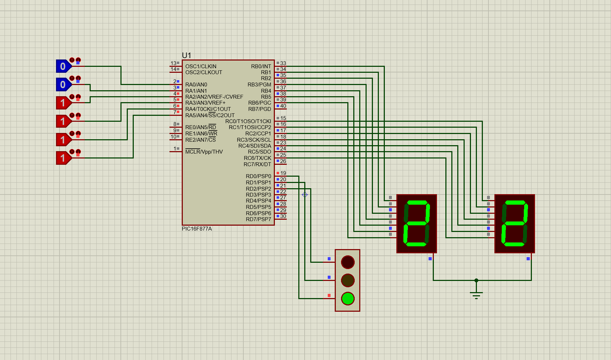

# Traffic-Light-PIC
A traffic light simulation designed with PIC16F877A, programmed in MikroC, and simulated in Proteus. 
The system controls red, yellow, and green traffic lights, and uses 7-segment displays to show countdown timers.

An intelligent feature is added:
✅ When the number of vehicles (read from RA0–RA5 inputs) exceeds 50, the green light duration increases from 20 to 25 seconds to reduce traffic congestion.
Otherwise, the green light stays at its normal 20 seconds.

🧰 Technologies Used:
- PIC16F877A Microcontroller
- MikroC PRO for PIC
- Proteus 8
- 7-Segment Displays (dual-digit)

